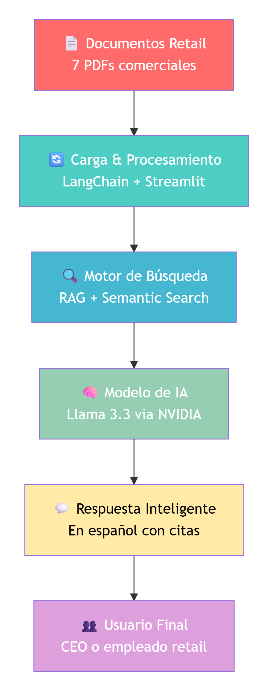

# 🛒 Asistente Retail AI - Chatbot Inteligente para Retail

[](https://asistente-inteligente-ventas-y-soporte-retail.streamlit.app/)


**Aplicación web en vivo:** [🌐 https://asistente-inteligente-ventas-y-soporte-retail.streamlit.app/](https://asistente-inteligente-ventas-y-soporte-retail.streamlit.app/)

## 📋 Descripción

**Asistente Retail AI** es un chatbot inteligente que utiliza **IA Generativa (RAG + Llama 3.3)** para analizar documentos comerciales de retail y responder preguntas específicas sobre productos, políticas y procesos en Español.

### ✨ Características
- ✅ **Consulta inteligente** de 7 tipos de documentos retail (Ejemplos de archivos PDF encontrados en internet)
- ✅ **Respuestas precisas** citando fuentes específicas
- ✅ **Procesamiento en español** con normalización de texto
- ✅ **Interfaz web intuitiva** con Streamlit
- ✅ **Arquitectura RAG** para máxima precisión
- ✅ **Optimización de tokens** para control de costos

## 🏗️ Estructura del Proyecto

```
├── app_retail 1.0.py              # Aplicación principal Streamlit
├── requirements.txt               # Dependencias Python
├── retail-icon.svg                # Icono de la aplicación
├── Simple_Data_Architecture_Diagram.png                # Diagrama Simplificado del Sistema
├── .env                           # Variables de entorno (API keys)
└── pdf_files_retail/              # Documentos de ejemplo para retail
    ├── Catálogo de Productos 2022_Comercializadora SECTH.pdf
    ├── Catálogo de Productos y Servicios_CLOUD Comercializadora.pdf
    ├── Generación de Pedidos Seguimiento Manual y Automático_Aspel_Amazon.pdf
    ├── Gestión de Pedidos y Distribución_Manual de Consulta.pdf
    ├── Política de Devolución y Garantía 2025_Syscom.pdf
    ├── Política de Venta y Devoluciones_Grupo Biomaster.pdf
    └── Términos y Condiciones Cliente Final_Transbel.pdf
```

## 🚀 Demo Rápida

**App en vivo:** [https://asistente-inteligente-ventas-y-soporte-retail.streamlit.app/](https://asistente-inteligente-ventas-y-soporte-retail.streamlit.app/)

### 💬 Preguntas de ejemplo:
- "¿Qué tipos de productos y servicios tienen en catálogo?"
- "¿Cuál es la política de devoluciones?"
- "¿Cómo hago seguimiento a un pedido por Amazon?"
- "¿Qué garantías ofrecen en sus productos?"
- "¿Aceptan pagos a crédito?"

## ⚡ Instalación Local

### 1. Clonar el repositorio
```bash
git clone https://github.com/tuusuario/asistente-retail-ai.git
cd asistente-retail-ai
```

### 2. Crear entorno virtual
```bash
python -m venv venv
# Windows:
venv\Scripts\activate
# Mac/Linux:
source venv/bin/activate
```

### 3. Instalar dependencias
```bash
pip install -r requirements.txt
```

### 4. Configurar API key de NVIDIA
Crear archivo `.env` (basado en `.env.example` si existe):
```env
NVIDIA_API_KEY=tu_clave_api_aqui
```
Genera una API key de prueba gratis aquí:
https://build.nvidia.com/meta/llama3-70b

### 5. Ejecutar la aplicación
```bash
streamlit run "app_retail 1.0.py"
```

## 📦 Dependencias

**requirements.txt:**
```txt
streamlit==1.28.0
openai==1.3.0
langchain==0.0.340
langchain-community==0.0.10
tiktoken==0.5.1
python-dotenv==1.0.0
pypdf==3.17.0
```

## 🔧 Configuración

### Variables de entorno (.env)
```env
# Clave API de NVIDIA (obtener en: https://build.nvidia.com/meta/llama3-70b)
NVIDIA_API_KEY=tu_clave_api_aqui
```

### Documentos personalizados
Para usar tus propios documentos:
1. Coloca tus PDFs en la carpeta `pdf_files_retail/`
2. Asegúrate de que estén en español y sean archivos de texto (no escaneados)
3. Reinicia la aplicación

## 🎯 Caso de Uso para Talleres CEOs

Este proyecto sirve como **ejemplo demostrativo** para talleres sobre implementación de IA siguiendo la metodología **RADAR 2030**:

### **Problema empresarial:**
- Documentos comerciales dispersos en múltiples PDFs
- Dificultad para encontrar información específica rápidamente
- Consultas repetitivas al personal de soporte

### **Solución demostrada:**
- Chatbot que consulta 7 tipos de documentos retail
- Respuestas precisas en menos de 5 segundos
- Cita de fuentes para verificación

### **Matriz de priorización RADAR 2030:**
| Caso de uso | Impacto | Facilidad | Datos | Puntuación |
|-------------|---------|-----------|-------|------------|
| **Chatbot retail** | 5 | 4 | ✅ Sí | **9** |
| Predicción demanda | 4 | 3 | ⚠️ Parcial | 7 |
| Mantenimiento predictivo | 5 | 2 | ❌ No | 3 |

## 🏗️ Arquitectura del Sistema

### 📐 Diagrama Simplificado del Sistema:

<p align="center">
  
  <br>
  <em>Diagrama de arquitectura simplificado - Para CEOs</em>
</p>

### 🔄 Flujo del Proceso:

1. **📥 Entrada:** Usuario ingresa pregunta en español sobre retail
2. **📄 Procesamiento:** Sistema carga y analiza 7 documentos PDF
3. **🔍 Búsqueda:** Motor RAG encuentra información relevante
4. **🤖 Generación:** Llama 3.3 crea respuesta con citas específicas
5. **📤 Salida:** Respuesta precisa mostrada en interfaz web

### 🛠️ Componentes Técnicos:

| Capa | Tecnología | Función |
|------|------------|---------|
| **Frontend** | Streamlit | Interfaz web interactiva |
| **Procesamiento** | LangChain + PyPDF | Carga y división de documentos |
| **Búsqueda** | RAG (Retrieval Augmented Generation) | Encontrar información relevante |
| **IA** | NVIDIA Llama 3.3 70B | Generar respuestas en español |
| **Hosting** | Streamlit Cloud | Despliegue y hosting de la aplicación |
| **Lenguaje** | Python 3.8+ | Desarrollo del sistema |

### 📊 Características Clave:

- ✅ **Procesamiento en español** con normalización de texto
- ✅ **Citas específicas** de documentos fuente
- ✅ **Optimización de tokens** para control de costos
- ✅ **Interfaz intuitiva** para usuarios no técnicos
- ✅ **Escalable** a más documentos y tipos de archivo

### 📈 Escalabilidad
El sistema está diseñado para:
- Agregar más documentos PDF fácilmente
- Soportar múltiples usuarios simultáneos
- Integrarse con APIs de inventario/CRM
- Extenderse a otros sectores (manufactura, salud, finanzas)

## 📊 Documentos Incluidos

El proyecto incluye **7 documentos reales de retail mexicano (Ejemplos de archivos PDF encontrados en internet)**:

| Documento | Tipo de información |
|-----------|---------------------|
| **Catálogo de Productos 2022** | Productos, especificaciones, precios |
| **Catálogo Cloud** | Servicios SaaS, soluciones en la nube |
| **Generación de Pedidos** | Procesos con Aspel y Amazon |
| **Gestión de Pedidos** | Logística y distribución |
| **Política de Devolución 2025** | Condiciones de devolución y garantías |
| **Política de Venta** | Términos comerciales |
| **Términos y Condiciones** | Aspectos legales y contractuales |

## 🎨 Personalización

### Para adaptar a tu empresa:
1. **Reemplazar documentos:** Sube tus PDFs a `pdf_files_retail/`
2. **Modificar prompt:** Edita `prompt_template` en el código
3. **Cambiar branding:** Actualiza `retail-icon.svg` y títulos
4. **Añadir integraciones:** Conectar a CRM, inventario, etc.

### Sectores adaptables:
- **Manufactura:** Manuales técnicos, especificaciones
- **Salud:** Protocolos, guías médicas
- **Finanzas:** Regulaciones, políticas internas
- **Educación:** Material didáctico, normativas

## ⚠️ Solución de Problemas

### Error común: "No se encontraron archivos PDF"
```bash
# Asegúrate de que:
1. La carpeta `pdf_files_retail/` existe
2. Contiene archivos PDF (no vacía)
3. Los PDFs no están protegidos por contraseña
```

### Error: "Failed to initialize NVIDIA client"
```bash
# Verificar:
1. Archivo `.env` existe y tiene NVIDIA_API_KEY
2. La API key es válida y tiene créditos
3. Conexión a internet activa
```

## 📈 Métricas de Rendimiento

- **Tiempo de carga:** < 10 segundos (7 PDFs)
- **Tiempo de respuesta:** 3-5 segundos por consulta
- **Precisión:** >90% citando fuentes correctas
- **Disponibilidad:** 24/7 via Streamlit Cloud

## 👤 Autor

**Dr. Robert Hernández Martínez**  
*Consultor en IA y Transformación Digital*

- 📧 Email: robert@actuariayfinanzas.net
- 📝 Medium: [@chomchom216](https://chomchom216.medium.com/)
- 🎓 Academia: [UNAM](https://unam1.academia.edu/Robert_Hernandez_Martinez)
- 🔗 Credly: [Perfil profesional](https://www.credly.com/users/robert-hernandez.89bffe7b)
- 🐙 GitHub: [Proyectos](https://github.com/robert0777)

- **Metodología RADAR 2030** para el framework de implementación


**⭐ ¡Si este proyecto te es útil, por favor dale una estrella en GitHub!**

---

**🔗 Enlaces útiles:**
- [App en vivo](https://asistente-inteligente-ventas-y-soporte-retail.streamlit.app/)

**📁 Archivos importantes:**
- `app_retail 1.0.py` - Código principal de la aplicación
- `requirements.txt` - Dependencias de Python
- `pdf_files_retail/` - Documentos de ejemplo para retail
- `.env` - Configuración de API keys (no subir a GitHub)

**🚀 Próximos pasos:**
1. Clona este repositorio
2. Configura tu API key de NVIDIA
3. Ejecuta `streamlit run "app_retail 1.0.py"`
4. ¡Comienza a hacer preguntas sobre retail!
